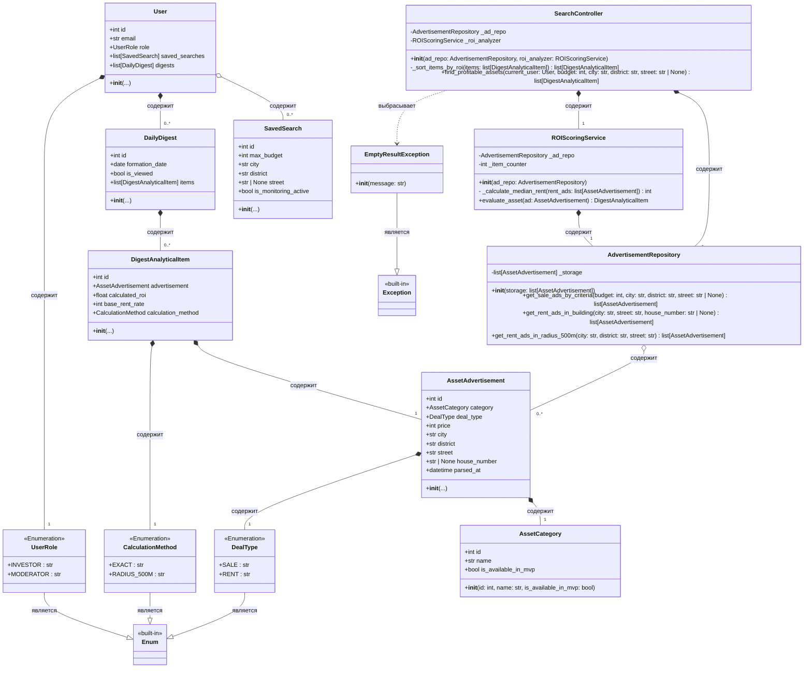

```mermaid
classDiagram
    direction TB

    %% БАЗОВЫЕ КЛАССЫ PYTHON
    class Enum {
        <<built-in>>
    }
    class Exception {
        <<built-in>>
    }

    %% ПЕРЕЧИСЛЕНИЯ И ИСКЛЮЧЕНИЯ
    class DealType {
        <<Enumeration>>
        +SALE : str
        +RENT : str
    }

    class UserRole {
        <<Enumeration>>
        +INVESTOR : str
        +MODERATOR : str
    }

    class CalculationMethod {
        <<Enumeration>>
        +EXACT : str
        +RADIUS_500M : str
    }

    class EmptyResultException {
        +__init__(message: str)
    }

    %% МОДЕЛИ ПРЕДМЕТНОЙ ОБЛАСТИ (Entities)
    class AssetCategory {
        +int id
        +str name
        +bool is_available_in_mvp
        +__init__(id: int, name: str, is_available_in_mvp: bool)
    }

    class AssetAdvertisement {
        +int id
        +AssetCategory category
        +DealType deal_type
        +int price
        +str city
        +str district
        +str street
        +str | None house_number
        +datetime parsed_at
        +__init__(...)
    }

    class DigestAnalyticalItem {
        +int id
        +AssetAdvertisement advertisement
        +float calculated_roi
        +int base_rent_rate
        +CalculationMethod calculation_method
        +__init__(...)
    }

    class SavedSearch {
        +int id
        +int max_budget
        +str city
        +str district
        +str | None street
        +bool is_monitoring_active
        +__init__(...)
    }

    class DailyDigest {
        +int id
        +date formation_date
        +bool is_viewed
        +list[DigestAnalyticalItem] items
        +__init__(...)
    }

    class User {
        +int id
        +str email
        +UserRole role
        +list[SavedSearch] saved_searches
        +list[DailyDigest] digests
        +__init__(...)
    }

    %% ПОВЕДЕНЧЕСКИЕ И СЕРВИСНЫЕ КЛАССЫ (Композиция поведения)
    class AdvertisementRepository {
        -list[AssetAdvertisement] _storage
        +__init__(storage: list[AssetAdvertisement])
        +get_sale_ads_by_criteria(budget: int, city: str, district: str, street: str | None) list[AssetAdvertisement]
        +get_rent_ads_in_building(city: str, street: str, house_number: str | None) list[AssetAdvertisement]
        +get_rent_ads_in_radius_500m(city: str, district: str, street: str) list[AssetAdvertisement]
    }

    class ROIScoringService {
        -AdvertisementRepository _ad_repo
        -int _item_counter
        +__init__(ad_repo: AdvertisementRepository)
        - _calculate_median_rent(rent_ads: list[AssetAdvertisement]) int
        +evaluate_asset(ad: AssetAdvertisement) DigestAnalyticalItem
    }

    class SearchController {
        -AdvertisementRepository _ad_repo
        -ROIScoringService _roi_analyzer
        +__init__(ad_repo: AdvertisementRepository, roi_analyzer: ROIScoringService)
        -_sort_items_by_roi(items: list[DigestAnalyticalItem]) list[DigestAnalyticalItem]
        +find_profitable_assets(current_user: User, budget: int, city: str, district: str, street: str | None) list[DigestAnalyticalItem]
    }

    %% ОТНОШЕНИЯ НАСЛЕДОВАНИЯ ("является")
    DealType --|> Enum : является
    UserRole --|> Enum : является
    CalculationMethod --|> Enum : является
    EmptyResultException --|> Exception : является

    %% ОТНОШЕНИЯ КОМПОЗИЦИИ И АГРЕГАЦИИ ("содержит")
    AssetAdvertisement *-- "1" AssetCategory : содержит
    AssetAdvertisement *-- "1" DealType : содержит
    DigestAnalyticalItem *-- "1" AssetAdvertisement : содержит
    DigestAnalyticalItem *-- "1" CalculationMethod : содержит
    DailyDigest *-- "0..*" DigestAnalyticalItem : содержит
    User o-- "0..*" SavedSearch : содержит
    User *-- "0..*" DailyDigest : содержит
    User *-- "1" UserRole : содержит

    %% МЕХАНИЗМ КОМПОЗИЦИИ ПОВЕДЕНИЯ ("содержит" сервисы)
    AdvertisementRepository o-- "0..*" AssetAdvertisement : содержит
    ROIScoringService *-- "1" AdvertisementRepository : содержит
    SearchController *-- "1" AdvertisementRepository : содержит
    SearchController *-- "1" ROIScoringService : содержит
    SearchController ..> EmptyResultException : выбрасывает
```
