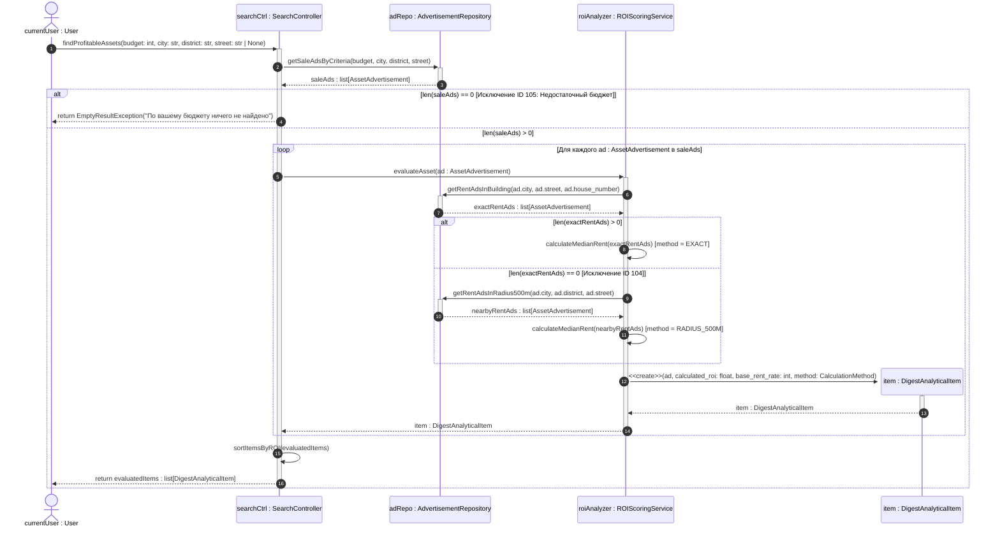

```mermaid
sequenceDiagram
    autonumber
    actor Investor as currentUser : User
    participant Controller as searchCtrl : SearchController
    participant Repo as adRepo : AdvertisementRepository
    participant Analyzer as roiAnalyzer : ROIScoringService

    %% Шаг 1: Инициация поиска пользователем
    Investor->>+Controller: findProfitableAssets(budget: int, city: str, district: str, street: str | None)

    %% Шаг 2: Запрос подходящих объявлений о продаже из репозитория
    Controller->>+Repo: getSaleAdsByCriteria(budget, city, district, street)
    Repo-->>-Controller: saleAds : list[AssetAdvertisement]

    alt len(saleAds) == 0 [Исключение ID 105: Недостаточный бюджет]
        Controller-->>Investor: return EmptyResultException("По вашему бюджету ничего не найдено")
    else len(saleAds) > 0
        %% Шаг 3: Цикл оценки каждого найденного объекта
        loop Для каждого ad : AssetAdvertisement в saleAds
            Controller->>+Analyzer: evaluateAsset(ad : AssetAdvertisement)
            
            %% Внутреннее обращение за аналогами аренды
            Analyzer->>+Repo: getRentAdsInBuilding(ad.city, ad.street, ad.house_number)
            Repo-->>-Analyzer: exactRentAds : list[AssetAdvertisement]

            alt len(exactRentAds) > 0
                Analyzer->>Analyzer: calculateMedianRent(exactRentAds) [method = EXACT]
            else len(exactRentAds) == 0 [Исключение ID 104]
                Analyzer->>+Repo: getRentAdsInRadius500m(ad.city, ad.district, ad.street)
                Repo-->>-Analyzer: nearbyRentAds : list[AssetAdvertisement]
                Analyzer->>Analyzer: calculateMedianRent(nearbyRentAds) [method = RADIUS_500M]
            end

            %% Шаг 4: Динамическое создание экземпляра аналитического элемента
            create participant Item as item : DigestAnalyticalItem
            Analyzer->>+Item: <<create>>(ad, calculated_roi: float, base_rent_rate: int, method: CalculationMethod)
            Item-->>-Analyzer: item : DigestAnalyticalItem

            Analyzer-->>-Controller: item : DigestAnalyticalItem
        end

        %% Шаг 5: Сортировка и возврат коллекции объектов
        Controller->>Controller: sortItemsByROI(evaluatedItems)
        Controller-->>-Investor: return evaluatedItems : list[DigestAnalyticalItem]
    end
```
