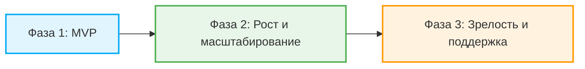

```mermaid
graph LR
    A[Фаза 1: MVP] --> B[Фаза 2: Рост и масштабирование]
    B --> C[Фаза 3: Зрелость и поддержка]
    
    style A fill:#e1f5fe,stroke:#03a9f4,stroke-width:2px
    style B fill:#e8f5e9,stroke:#4caf50,stroke-width:2px
    style C fill:#fff3e0,stroke:#ff9800,stroke-width:2px
```
