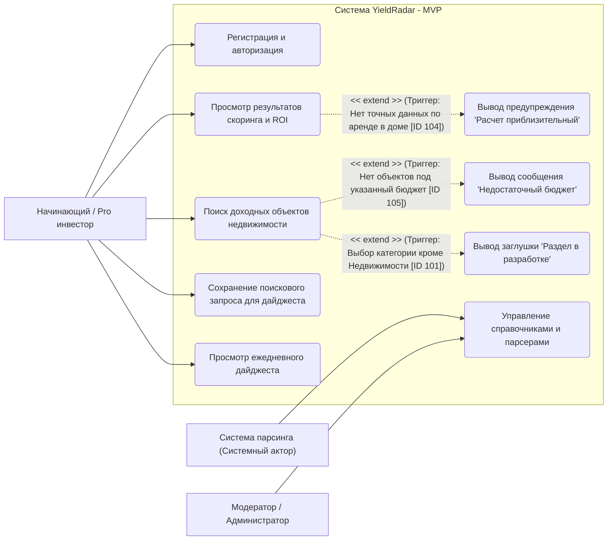

```mermaid
flowchart LR
    direction LR

    %% АКТОРЫ
    User["Начинающий / Pro инвестор"]
    Admin["Модератор / Администратор"]
    Parser["Система парсинга (Системный актор)"]

    %% СИСТЕМА
    subgraph YieldRadar [Система YieldRadar - MVP]
        UC1(Регистрация и авторизация)
        UC2(Поиск доходных объектов недвижимости)
        UC3(Просмотр результатов скоринга и ROI)
        UC4(Сохранение поискового запроса для дайджеста)
        UC5(Просмотр ежедневного дайджеста)
        
        %% Альтернативные сценарии и исключения
        UC6(Вывод предупреждения 'Расчет приблизительный')
        UC7(Вывод сообщения 'Недостаточный бюджет')
        UC8(Вывод заглушки 'Раздел в разработке')
        
        %% Администрирование
        UC9(Управление справочниками и парсерами)
    end

    %% СВЯЗИ АКТОРОВ С ПРЕЦЕДЕНТАМИ
    User --> UC1
    User --> UC2
    User --> UC3
    User --> UC4
    User --> UC5

    Parser --> UC9

    Admin --> UC9

    %% СВЯЗИ МЕЖДУ ПРЕЦЕДЕНТАМИ
    UC2 -.->|"<< extend >> (Триггер: Выбор категории кроме Недвижимости [ID 101])"| UC8
    UC2 -.->|"<< extend >> (Триггер: Нет объектов под указанный бюджет [ID 105])"| UC7
    UC3 -.->|"<< extend >> (Триггер: Нет точных данных по аренде в доме [ID 104])"| UC6
```
